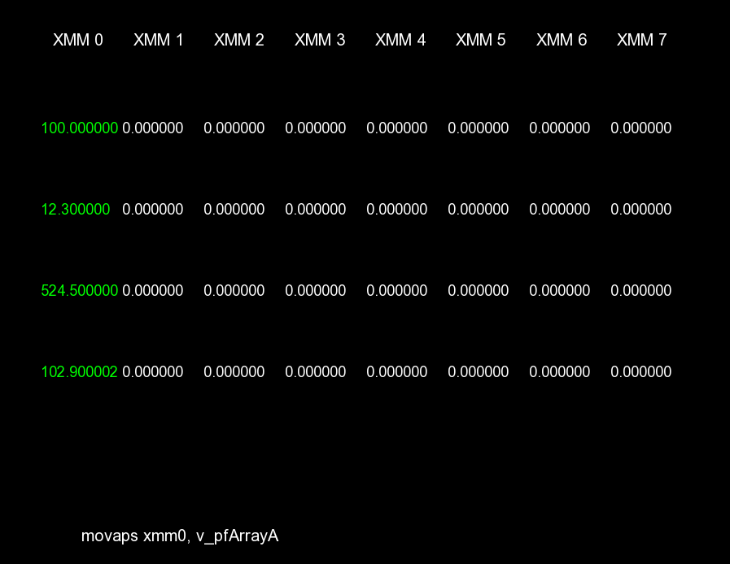

# Project

SSE (Streaming Single-Instruction Multiple-Data Extensions) instruction set simulator:
https://en.wikipedia.org/wiki/Streaming_SIMD_Extensions.

Simulation includes eight 128-bit registers (XMM0 - XMM7), each represented on screen by four 32-bit single-precision floating-point numbers.

Below, the last executed instruction is shown.
Memory access (variable declaration) is included in the simulation, but not printed to the screen.

Simulation works on a step-by-step (line-by-line of assembly code) basis, with changes between steps highlighted.



# Use
Simulation is controlled via the left (back / previous step) and right (forward / next step) arrow keys.

SSE instructions can be changed in the `main.asm` file located in the resource directory.

Every instruction must be separated with an endline.
Whitespace before and after instruction will be ignored.
Instructions may be in upper- or lower-case, but not mixed.
Unrecognized instructions will be treated as comments and ignored.

Currently implemented instructions:
1. Data movement:
    * scalar - movss
    * packed - movaps/movups
1. Addition:
    * scalar - addss
    * packed - addps
1. Subtraction:
    * scalar - subss
    * packed - subps
1. Multiplication:
    * scalar - mulss
    * packed - mulps
1. Division:
    * scalar - divss
    * packed - divps
1. Square root:
    * scalar - sqrtss
    * packed - sqrtps
1. Comparison:
    * scalar - cmpeqss, cmpltss, cmpnless
    * packed - cmpeqps,cmpltps, cmpnleps
1. Variable assignment:
    * _declspec()

Basic class documentation & overview is provided in the docs directory.

# Compilation
To recompile project, you will need to link statically SFML library (2.5.1+, *not* included in project).
To do that, change the below paths in the Makefile file, with accordance to your install directory:
```
SFINC="include folder path"
SFLIB="lib folder path"
```
After that, simply run make in project dir.